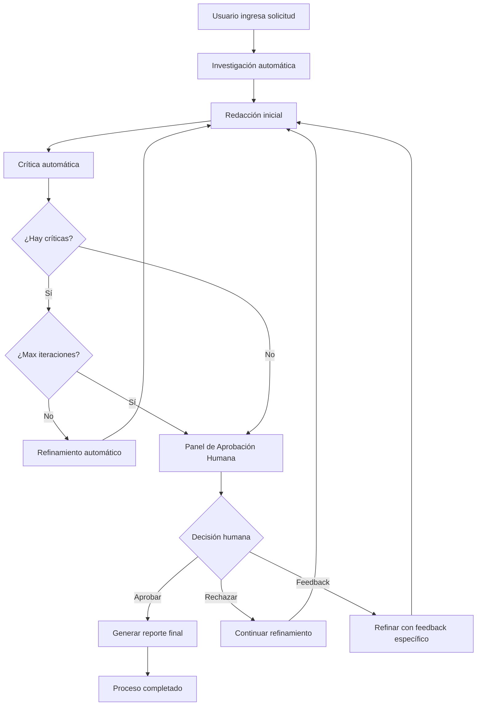

# 🎉 ¡LangGraph Marketing Agent con Feedback Humano - COMPLETO!

## ✅ Funcionalidades Implementadas

### 🤖 Backend (FastAPI + LangGraph)
- ✅ **Agente completo**: Investigación → Redacción → Crítica → Refinamiento
- ✅ **Bucle de crítica y refinamiento**: Iteraciones automáticas hasta alcanzar calidad
- ✅ **Aprobación humana**: Interfaz web para revisar y aprobar posts
- ✅ **Feedback humano**: Opción de dar feedback específico para mejoras
- ✅ **WebSocket en tiempo real**: Monitoreo como terminal en vivo
- ✅ **API REST**: Endpoints para gestión de tareas
- ✅ **Generación de reportes**: Informes automáticos en Markdown

### 🎨 Frontend (React + TypeScript)
- ✅ **Interfaz moderna**: Diseño profesional con gradientes y animaciones
- ✅ **Monitoreo en tiempo real**: Logs en vivo como la terminal original
- ✅ **Ejemplos predefinidos**: Botones con solicitudes comunes
- ✅ **Configuración flexible**: Control de iteraciones máximas (1-5)
- ✅ **Interfaz de aprobación humana**: Panel interactivo para revisar posts
- ✅ **Tres opciones de feedback**:
  - **Aprobar**: Finaliza el proceso y genera reporte
  - **Rechazar**: Continúa el refinamiento automático
  - **Feedback específico**: Proporciona instrucciones detalladas
- ✅ **Responsive**: Funciona en desktop y móvil

## 🚀 Cómo Usar el Sistema Completo

### 1. Servicios Funcionando
Ya tienes ambos servicios corriendo:
- **Backend**: http://localhost:8000 ✅
- **Frontend**: http://localhost:3000 ✅

### 2. Flujo de Trabajo Completo

#### Paso 1: Configurar Solicitud
1. Abre http://localhost:3000 en tu navegador
2. Selecciona un ejemplo o escribe tu solicitud personalizada
3. Configura las iteraciones máximas (recomendado: 3)
4. Haz clic en "Generate Marketing Post"

#### Paso 2: Monitoreo en Tiempo Real
Verás el progreso en vivo:
- 🔍 **Investigación**: Análisis de mercado y audiencia
- ✍️ **Redacción inicial**: Primer borrador del post
- 🔍 **Crítica**: Evaluación automática
- 🔄 **Refinamiento**: Mejoras iterativas (si es necesario)

#### Paso 3: ⭐ **NUEVA FUNCIONALIDAD** - Aprobación Humana
Cuando el sistema esté listo, aparecerá un panel especial:

**Panel de Aprobación Humana** 👤
- **Vista del post**: Borrador actual con número de iteración
- **Problemas pendientes**: Lista de críticas no resueltas (si las hay)
- **Campo de feedback**: Área de texto para instrucciones específicas

**Tres Opciones de Acción**:

1. **✅ Aprobar & Completar**
   - Acepta el post tal como está
   - Genera el reporte final automáticamente
   - Proceso completado ✅

2. **❌ Rechazar & Reintentar**
   - El sistema continuará refinando automáticamente
   - Usa las críticas de IA para mejoras
   - Volverás a ver el panel de aprobación después

3. **💬 Enviar Feedback & Refinar**
   - Proporciona instrucciones específicas en el campo de texto
   - El sistema refinará según TU feedback exacto
   - Ejemplo: "Hacer más profesional", "Añadir más emojis", "Cambiar el tono a casual"
   - Volverás a ver el panel de aprobación con la nueva versión

#### Paso 4: Resultados Finales
Una vez aprobado:
- **Post final**: Listo para publicar
- **Investigación completa**: Datos de audiencia, hashtags, insights
- **Métricas del proceso**: Iteraciones, tiempo, etc.
- **Reporte Markdown**: Documento completo generado automáticamente

## 🎯 Ejemplos de Uso del Feedback Humano

### Feedback Específico Efectivo:
- ✅ "Hacer el tono más casual y amigable"
- ✅ "Añadir más datos estadísticos"
- ✅ "Cambiar el call-to-action para ser más directo"
- ✅ "Reducir el texto a máximo 200 caracteres"
- ✅ "Enfocarse más en los beneficios que en las características"

### Lo Que Hace el Sistema:
- **Prioriza tu feedback**: Tu input humano tiene precedencia sobre las críticas de IA
- **Refinamiento inteligente**: Usa GPT-4o para implementar tus sugerencias específicas
- **Preserva lo bueno**: Mantiene las fortalezas del post mientras mejora lo solicitado
- **Iteración controlada**: Puedes dar feedback múltiples veces hasta estar satisfecho

## 🔄 Flujo Técnico Completo

## 🎉 Características Únicas del Sistema

### 1. **Híbrido IA + Humano**
- Lo mejor de ambos mundos: eficiencia de IA + juicio humano
- El humano tiene control final pero no necesita hacer todo el trabajo

### 2. **Tiempo Real**
- Ves exactamente lo que está pasando, como en la terminal original
- No hay cajas negras, total transparencia

### 3. **Flexibilidad Total**
- Puedes aprobar rápidamente si está bien
- Puedes ser muy específico con feedback detallado
- Puedes rechazar y dejar que la IA continue sola

### 4. **Preservación del Contexto**
- Toda la investigación y contexto se mantiene a través de las iteraciones
- El sistema "recuerda" tu solicitud original y la investigación

### 5. **Documentación Completa**
- Cada proceso genera un reporte detallado
- Histórico de iteraciones y decisiones
- Métricas de performance

## 🚀 ¡Listo para Usar!

El sistema está **completamente funcional** y replicando la experiencia original de línea de comandos pero con una interfaz moderna y capabilities adicionales.

**URLs para usar**:
- **Aplicación principal**: http://localhost:3000
- **API Documentation**: http://localhost:8000/docs
- **Health check**: http://localhost:8000/health

**¡Disfruta tu Marketing Agent con feedback humano! 🎯✨**
